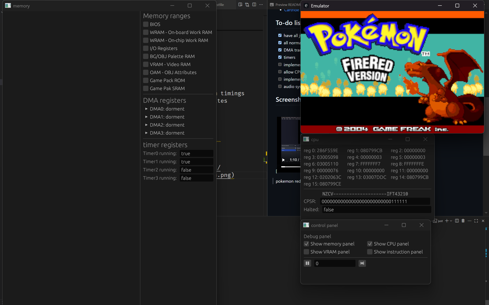

# Game Boy Advance Emulator

A Game Boy Advance emulator written from scratch in Rust, with a built-in debugger. The CPU core passes the [SingleStepTests ARM7TDMI](https://github.com/SingleStepTests/ARM7TDMI) conformance suite for both the ARM and THUMB instruction sets.



## Features

**Emulation**

- Full ARM7TDMI interpreter: ARM and THUMB instruction sets
- PPU rendering for the regular (non-affine) background modes
- DMA transfers
- Timers
- EEPROM cartridge saves (basic; see [Status](#status))
- Optional boot through the BIOS (`from-bios` feature)

**Debugger**

- Instruction disassembler
- Live CPU register viewer and editor
- Live memory viewer and editor
- Single-step execution
- CPU throttling

The debugger is behind the `debug` feature, which is on by default.

## Status

| Component | State |
| --- | --- |
| ARM7TDMI (ARM + THUMB) | Done, passes all SingleStepTests JSON tests |
| Regular background modes | Done |
| DMA | Done |
| Timers | Done |
| EEPROM | Works, needs to be more accurate |
| Per-instruction cycle timings | Not yet |
| Affine backgrounds and sprites | Not yet |
| Audio | Not yet |

<!-- TODO: compatibility list. Even three or four rows help:
| Game | State | Notes |
| --- | --- | --- |
-->

## Getting started

### Requirements

- A recent stable [Rust toolchain](https://rustup.rs/)
- [`just`](https://github.com/casey/just) (optional, for the shortcuts below)
- Your own GBA ROMs. No ROMs or BIOS images are included in this repository.

### Build and run

```sh
git clone https://github.com/Boskeroni/GameboyAdvanced.git
cd GameboyAdvanced
cargo run -- games/<rom>.gba
```

The dev profile is set to `opt-level = 3`, so a plain `cargo run` is fast enough to play games.

### `just` recipes

The `justfile` uses PowerShell, so the recipes work as-is on Windows. On Linux or macOS, use the equivalent `cargo` command instead.

| Recipe | What it does | Cargo equivalent |
| --- | --- | --- |
| `just play <game>` | Runs `games/<game>.gba` (leave off the `.gba`) | `cargo run -- games/<game>.gba` |
| `just test <path>` | Runs a test ROM at `<path>.gba` | `cargo run -- <path>.gba` |
| `just json-test` | Runs every test in the SingleStepTests ARM7TDMI suite instead of loading a ROM | `cargo run --features json-test` |
| `just bios-test` | Boots a game through the BIOS, used for testing the BIOS path | `cargo run --features from-bios -- games/<rom>.gba` |

### Controls

<!-- TODO: fill in the real key bindings.
| GBA | Keyboard |
| --- | --- |
| D-pad | |
| A / B | |
| L / R | |
| Start / Select | |
-->

## Testing

CPU correctness is checked against [SingleStepTests' ARM7TDMI suite](https://github.com/SingleStepTests/ARM7TDMI): each JSON test gives an initial CPU and memory state, one instruction, and the expected state afterwards. Building with the `json-test` feature swaps the normal ROM loop for a runner that executes every test:

```sh
just json-test
```

Beyond the CPU, behaviour is checked against [jsmolka's gba-tests](https://github.com/jsmolka/gba-tests) ROMs via `just test`.

## Project layout

```
core/      gba_core crate: the emulator itself
src/       desktop frontend and debugger (egui / eframe)
include/   screenshots
justfile   shortcuts for running games and tests
```

### Cargo features

| Feature | Default | Purpose |
| --- | --- | --- |
| `debug` | yes | Enables the debugger UI |
| `json-test` | no | Runs the SingleStepTests suite instead of a ROM |
| `from-bios` | no | Starts execution from the BIOS |

## Why I built this

I built a [Game Boy emulator](https://github.com/Boskeroni/GameboyEmulator) first, but the SM83 felt too far from how most real systems work. The GBA was the natural next step: a 32-bit ARM CPU with two instruction sets, a pipeline, processor modes and proper exceptions, sitting behind hardware that is still simple enough for one person to understand end to end.

Next up is probably a GameCube emulator.

## Resources

- [GBATEK](https://problemkaputt.de/gbatek.htm): the reference for GBA hardware
- [jsmolka's gba-tests](https://github.com/jsmolka/gba-tests/tree/master): test ROMs
- [Normmatt's BIOS disassembly](https://github.com/Normmatt/gba_bios)
- [DenSinH on EEPROM saves](https://densinh.github.io/DenSinH/emulation/2021/02/01/gba-eeprom.html): clearer than GBATEK on this
- [SingleStepTests ARM7TDMI](https://github.com/SingleStepTests/ARM7TDMI): per-instruction CPU tests
